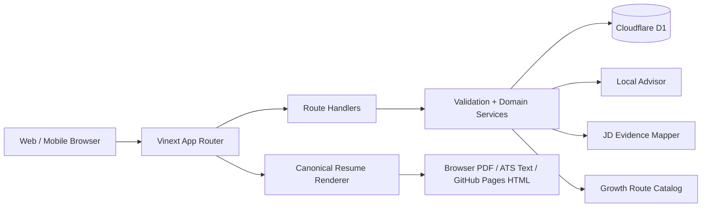
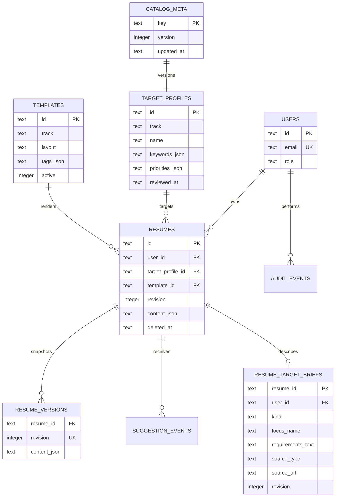

# 简迹 CV 架构说明

## 1. 架构决策

当前版本采用模块化单体，运行在 Sites / Cloudflare Worker 兼容环境中：

选择模块化单体而非微服务，是为了在产品验证阶段保持一条可测试、可部署的完整链路。未来上传、AI 和 PDF 导出成为长任务后，可按边界拆为 Worker，而简历领域模型和 API 契约保持稳定。

## 2. 模块边界

- Identity：随机 HttpOnly 访客会话映射到独立用户，预留实名账号与角色模型。
- Target Catalog：101 所院校与 85 家企业的编辑适配方案，包含类别、地区、关键词、优先级、来源类型与复核时间。
- Template：16 套版式映射到 8 个专业阅读情境；模板拥有密度、排版理由和设计原则，按目标企业与具体岗位推荐而不伪装成官方模板。
- Resume：简历项目、当前修订、内容 JSON 和软删除。
- Target Brief：每份简历可独立保存目标岗位/项目、要求文本、来源标签与链接、记录日期和独立修订。
- Job Evidence：确定性提取岗位要求，只引用用户简历原文，输出直接证据、相关线索、缺口与撰写动作。
- Rewrite Grounding：为可叙述原文生成稳定字段定位，把岗位要求、原文、草稿、理由与缺失事实绑定为同一个 proposal；应用前再次比对原文并只替换该字段。
- Revision：每次内容更新生成不可变快照。
- Recommendation：目标化规则检查、可选模型建议、逐次同意记录和有界用量事件。
- Export：浏览器 A4 PDF、服务端 ATS 文本、JSON 与 GitHub Pages 单文件 HTML。
- Growth：官方课程资源目录与基于目标/现有技能证据的确定性优先级建议。
- Admin：聚合指标、内容治理与审计边界。

## 3. 数据模型

简历正文使用带 `schema_version` 的规范化 JSON 文档。章节条目拥有稳定 ID，样式和内容分离。关系型字段用于用户归属、目标、模板、状态和常用索引。

## 4. 并发与版本

- 客户端更新携带 `expectedRevision`。
- 服务端发现修订不一致时返回 `409 CONFLICT`。
- 成功更新后 `revision + 1`，同时写入 `resume_versions`。
- 删除为软删除，并写入审计事件。

当前更新使用 `WHERE revision = ? ... RETURNING` 检查条件写入，零行统一返回 409；随后保存修订快照。规模增长后应把“更新当前版本 + 插入快照”放入更严格的事务封装，并为幂等创建加入 `Idempotency-Key` 表。

## 5. AI 安全边界

Advisor 在平台 API 内提供两层能力：默认确定性规则分析，以及由服务端环境变量启用的 DeepSeek Responses API 适配层。外部模型只有在用户对本次请求显式同意后才会调用：

- 只返回建议和改写草稿，不直接修改简历。
- 不生成不存在的学历、职位、奖项或成果数字。
- 缺失数字时输出待核实占位语义。
- 建议结合赛道、目标画像与当前章节。
- 求职建议在有岗位依据时使用优先提取的最多 12 项要求，而不发送整段 JD；岗位描述被视为不可信数据，提示词注入不会改变系统任务。所有送模自由文本先移除常见招聘邮箱、电话、联系账号和联系人标识，不发送来源 URL。
- 基础建议不逐次写分析事件；用量表只保存随机会话标识、散列网络标识与时间。模型同意表保存简历 ID、用途、提供者、同意版本与时间，不记录完整 CV。
- 外部调用使用 DeepSeek 无状态 Responses API、JSON Schema 结构化输出、关闭思考模式和 25 秒超时，响应仍经过本地 Zod 校验。
- 模型不能自行决定证据来源：原文定位必须匹配服务端提供的候选，岗位要求与引用证据由确定性证据地图重新绑定。只有严格等于已审计确定性压缩规则结果的草稿可直接应用；自由改写、伪造定位、占位符或缺失事实未清空的草稿不会直接落盘。
- 概览分析通过显式字段投影移除姓名、邮箱、电话、教育/经历所在地和项目链接；其他请求只发送目标章节和最小必要上下文。
- 调用前限制模型输入为 60 KB；单条 D1 条件插入同时检查会话、散列网络标识与全局配额，不存在跨桶部分扣减。
- 会话租约限制同一访客只能有一个活动模型请求，全局租约限制为 4 路；客户端中断会传递给上游，过期租约可自动被后续请求接管。
- 同一模型连续三次网络、超时、鉴权/余额/模型配置、429 或 5xx 错误后开启 10 分钟熔断；内容拒答、普通请求错误与输出校验失败只回退当前请求，不允许用户内容触发全局停用。
- 模型未配置或调用失败时返回 `local-rules`，前端明确显示基础模式，不伪装成大模型结果。

生产扩展时，模型调用仍只能存在于适配层；下一步需补充提示词版本、动态预算配置、更广泛的敏感信息预检、同意撤回和供应商可观测性。

## 6. 权限

当前访客会话只能访问自己的简历；演示治理页也只读取当前会话摘要，不返回正文。计划角色：

- `USER`：仅管理自己的简历。
- `CONTENT_EDITOR`：编辑目标资料草稿。
- `PUBLISHER`：发布画像和模板。
- `ADMIN`：运营管理。
- `SUPER_ADMIN`：角色和高风险配置。

产品 `SUPER_ADMIN` 不等于服务器或云账号超级权限。运维使用独立 IAM、MFA、临时授权和完整审计。

## 7. 生产演进

- Auth：平台会话 / OAuth，HttpOnly、Secure、SameSite Cookie。
- Files：R2 保存上传源文件与导出产物，D1 保存所有权和生命周期。
- Export Worker：固定 Chromium + 授权 CJK 字体，导出后再做文本抽取检查。
- Observability：结构化日志、请求 ID、OpenTelemetry 与错误监控。
- Data：备份恢复演练、账号导出/删除、保留期限和区域化部署。

## 8. 公开网页与外部资源边界

- GitHub Pages 导出是静态、无脚本、无远程依赖的单文件 HTML；所有用户内容经过 HTML 转义，链接只允许 HTTP(S)，响应和文档内同时设置 CSP。
- 联系方式默认不进入网页文件；用户需要单独勾选并确认公开风险。
- 当前不请求 GitHub OAuth 权限，也不代表用户创建或公开仓库。
- 编辑器内的可选学习提示只指向提供方官方页面，不把未完成课程自动写入简历，也不承诺证书认可、录取或录用结果。
- BOSS、智联等招聘平台不是产品数据依赖。系统不打开用户保存的来源链接，不调用平台 API，也不抓取页面；第一阶段只处理用户粘贴并确认的单个 JD 文字，不进入跨用户检索、训练或公共职位库。当前不上传岗位截图，用户可先在设备端识别文字并核对后粘贴。若未来引入规模化来源，只接企业官方公开 ATS API、书面授权或许可数据 feed，并保留来源、使用依据、核验日期和下线记录。
