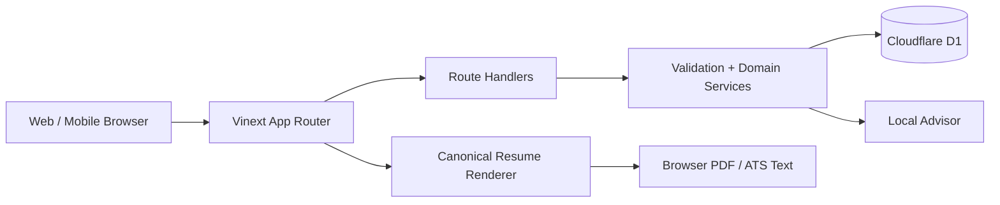
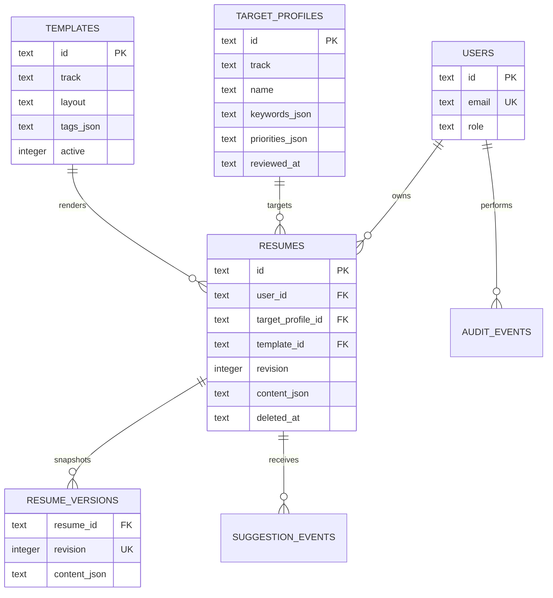

# 简迹 CV 架构说明

## 1. 架构决策

当前版本采用模块化单体，运行在 Sites / Cloudflare Worker 兼容环境中：

选择模块化单体而非微服务，是为了在产品验证阶段保持一条可测试、可部署的完整链路。未来上传、AI 和 PDF 导出成为长任务后，可按边界拆为 Worker，而简历领域模型和 API 契约保持稳定。

## 2. 模块边界

- Identity：随机 HttpOnly 访客会话映射到独立用户，预留实名账号与角色模型。
- Target Catalog：大学、企业、类别、地区、关键词、优先级和语气。
- Template：内容与样式分离的受控模板元数据。
- Resume：简历项目、当前修订、内容 JSON 和软删除。
- Revision：每次内容更新生成不可变快照。
- Recommendation：目标化规则检查、评分和建议事件。
- Export：浏览器 A4 PDF、服务端 ATS 文本与 JSON。
- Admin：聚合指标、内容治理与审计边界。

## 3. 数据模型

简历正文使用带 `schema_version` 的规范化 JSON 文档。章节条目拥有稳定 ID，样式和内容分离。关系型字段用于用户归属、目标、模板、状态和常用索引。

## 4. 并发与版本

- 客户端更新携带 `expectedRevision`。
- 服务端发现修订不一致时返回 `409 CONFLICT`。
- 成功更新后 `revision + 1`，同时写入 `resume_versions`。
- 删除为软删除，并写入审计事件。

当前更新使用 `WHERE revision = ? ... RETURNING` 检查条件写入，零行统一返回 409；随后保存修订快照。规模增长后应把“更新当前版本 + 插入快照”放入更严格的事务封装，并为幂等创建加入 `Idempotency-Key` 表。

## 5. AI 安全边界

当前 Advisor 是运行在平台 API 内的确定性规则引擎：

- 只返回建议和改写草稿，不直接修改简历。
- 不生成不存在的学历、职位、奖项或成果数字。
- 缺失数字时输出待核实占位语义。
- 建议结合赛道、目标画像与当前章节。
- 事件表只保存评分、章节、提供者等必要元数据，不记录完整 CV。

接入外部模型时，供应商 SDK 只能存在于适配层。网关应负责超时、重试上限、结构化输出校验、提示词版本、费用预算、敏感信息最小化和用户同意。

## 6. 权限

当前访客会话只能访问自己的简历；演示治理页也只读取当前会话摘要，不返回正文。计划角色：

- `USER`：仅管理自己的简历。
- `CONTENT_EDITOR`：编辑目标资料草稿。
- `PUBLISHER`：发布画像和模板。
- `ADMIN`：运营管理。
- `SUPER_ADMIN`：角色和高风险配置。

产品 `SUPER_ADMIN` 不等于服务器或云账号超级权限。运维使用独立 IAM、MFA、临时授权和完整审计。

## 7. 生产演进

- Auth：平台会话 / OAuth，HttpOnly、Secure、SameSite Cookie。
- Files：R2 保存上传源文件与导出产物，D1 保存所有权和生命周期。
- Export Worker：固定 Chromium + 授权 CJK 字体，导出后再做文本抽取检查。
- Observability：结构化日志、请求 ID、OpenTelemetry 与错误监控。
- Data：备份恢复演练、账号导出/删除、保留期限和区域化部署。
