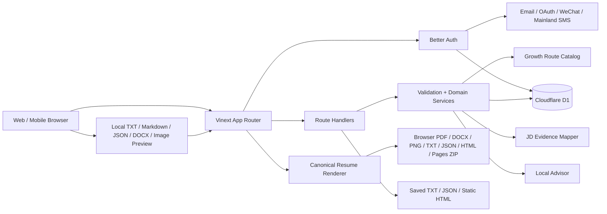
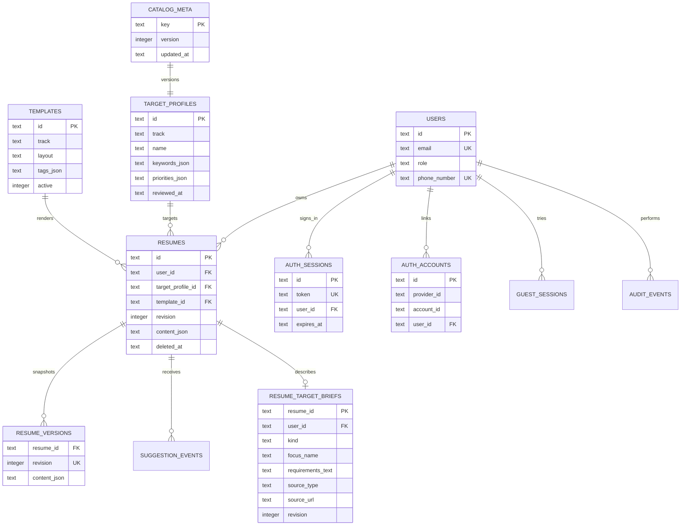

# 简迹 CV 架构说明

## 1. 架构决策

当前版本采用模块化单体，运行在 Sites / Cloudflare Worker 兼容环境中：

选择模块化单体而非微服务，是为了在产品验证阶段保持一条可测试、可部署的完整链路。未来若开放云端文件处理、OCR、AI 或异步批量导出，可按边界拆为 Worker，而简历领域模型和 API 契约保持稳定。

## 2. 模块边界

- Identity：Better Auth 提供邮箱、Google、GitHub、微信网站应用与中国大陆手机号认证，配套邮箱验证、密码重置、会话、账号绑定、停用与角色；随机 HttpOnly 访客会话仍可试用，登录后由服务端一次性认领其草稿。
- Target Catalog：101 所院校与 85 家企业的编辑适配方案，包含类别、地区、关键词、优先级、来源类型与复核时间。
- Template：16 套版式映射到 8 个专业阅读情境；模板拥有密度、排版理由和设计原则，按目标企业与具体岗位推荐而不伪装成官方模板。
- Resume：简历项目、当前修订、内容 JSON 和软删除。
- Target Brief：每份简历可独立保存目标岗位/项目、要求文本、来源标签与链接、记录日期和独立修订。
- Job Evidence：确定性提取岗位要求，只引用用户简历原文，输出直接证据、相关线索、缺口与撰写动作。
- Rewrite Grounding：为可叙述原文生成稳定字段定位，把岗位要求、原文、草稿、理由与缺失事实绑定为同一个 proposal；应用前再次比对原文并只替换该字段。
- Revision：每次内容更新生成不可变快照。
- Recommendation：目标化规则检查、可选模型建议、逐次同意记录和有界用量事件。
- Import / Export：浏览器本地读取 TXT、JSON，以纯文本方式读取 Markdown / DOCX，并本地预览图片；客户端生成 PDF、DOCX、PNG、TXT、JSON、HTML 与 GitHub Pages ZIP，服务端只提供已保存修订的 TXT、JSON 和静态单文件 HTML。
- Growth：官方课程资源目录与基于目标/现有技能证据的确定性优先级建议。
- Admin：聚合指标、内容治理与审计边界。

## 3. 数据模型

简历正文使用带 `schema_version` 的规范化 JSON 文档。章节条目拥有稳定 ID，样式和内容分离。关系型字段用于用户归属、目标、模板、状态和常用索引。

### 数据库启动与迁移

- `db/schema.ts` 是结构定义，`drizzle/*.sql` 是唯一建表和升级路径；生产迁移在部署阶段、接收请求之前执行。本地 `npm run dev` 通过 `predev` 使用同一批迁移，旧版请求期建表留下的本地数据库只补迁移台账，不删除已有数据。
- Worker 冷启动时，`ensureDatabase` 先用一条针对 `sqlite_schema` 的只读查询确认全部应用表存在，再读取一次目录版本。它不执行 `CREATE TABLE`、`CREATE INDEX`、`ALTER TABLE` 或其他修复型 DDL；结构不完整时快速失败，由健康检查返回不可用。
- 目录版本落后时，16 个模板和 186 个目标画像分别编码为一个 JSON 参数，通过 SQLite `json_each` 各用一条语句批量 upsert，最后写入目录版本。当前最坏初始化为 5 条 D1 查询，目录已是最新版时只有 2 条，远低于 D1 Free 单次调用的 50-query 限制，并给业务路由保留充足预算。
- 完整的已登录 DeepSeek 成功路径使用带真实 Better Auth 与 D1 适配器的回归测试计数：冷启动、目录播种与送模前 owner lease 续期场景为 41 条语句，必须始终保持在 45 条以内，为 D1 Free 的 50 条上限保留故障处理余量。
- 新增数据表、列或索引时必须提交新的顺序迁移，并在发布前从空 SQLite 数据库完整执行全部迁移；不得依赖运行时按请求探测并修补结构。
- `app_schema_meta` 是部署就绪门；当前 schema 版本同时由健康接口返回。关键枚举、修订号、JSON、模型 token 与 delivery 生命周期还有数据库触发器兜底，不能只依赖客户端或 Zod。

## 4. 并发与版本

- 客户端更新携带 `expectedRevision`。
- 服务端发现修订不一致时返回 `409 CONFLICT`。
- 成功更新后 `revision + 1`，CAS 更新与 `resume_versions` 快照在同一个 D1 batch 中提交；任一语句失败都会回滚。
- 删除为软删除并增加 revision，同一事务写入最终正文快照；审计在成功事务后记录。
- 创建使用条件 INSERT 在事务内检查活动/保留数量配额，并让初始版本与 target brief 只在主记录创建成功时写入。访客认领以同一事务重新计算账号与访客总量，不会出现部分转移。
- 列表使用不含正文的摘要投影和 `(updated_at, id)` 稳定游标；游标带用户与筛选 scope，Dashboard 搜索、赛道和状态都在服务端执行。

## 5. AI 安全边界

Advisor 在平台 API 内提供两层能力：默认确定性规则分析，以及由服务端环境变量启用的 DeepSeek Responses API 适配层。外部模型只有在用户对本次请求显式同意后才会调用：

- 只返回建议和改写草稿，不直接修改简历。
- 不生成不存在的学历、职位、奖项或成果数字。
- 缺失数字时输出待核实占位语义。
- 建议结合赛道、目标画像与当前章节。
- 求职建议在有岗位依据时使用优先提取的最多 12 项要求，而不发送整段 JD；岗位描述被视为不可信数据，提示词注入不会改变系统任务。所有送模自由文本先移除常见招聘邮箱、电话、联系账号和联系人标识，不发送来源 URL。
- 基础建议不逐次写分析事件；用量表只保存随机会话标识、散列网络标识与时间。模型同意表保存简历 ID、用途、提供者、同意版本与时间，不记录完整 CV。
- 外部调用使用 DeepSeek 无状态 Responses API、JSON Schema 结构化输出、关闭思考模式和 25 秒超时，响应仍经过本地 Zod 校验。
- 模型不能自行决定证据来源：原文定位必须匹配服务端提供的候选，岗位要求与引用证据由确定性证据地图重新绑定。只有严格等于已审计确定性压缩规则结果的草稿可直接应用；自由改写、伪造定位、占位符或缺失事实未清空的草稿不会直接落盘。
- 概览分析通过显式字段投影移除姓名、邮箱、电话、教育/经历所在地和项目链接；其他请求只发送目标章节和最小必要上下文。
- 调用前先限制原始模型输入为 32 KB，再对脱敏、字段投影和候选展开后的精确 provider body 重新计量；UTF-8 字节数加 10,000 token envelope 必须不超过 50,000 的保守输入上界，输出固定最多 2,200 token，随后按同一上下界预占日成本与 1–5 简迹点上限。公开点数价格表只允许走 DeepSeek V4 Flash，避免 Pro 误用同一价格；单条 D1 条件插入同时检查会话、散列网络标识与全局配额，不存在跨桶部分扣减。
- owner lease 限制同一账号只能有一个模型或账号生命周期操作，全局租约限制为 4 路；送模前续期并在同一条件 INSERT 中再次验证 lease、reserved ledger 与 prepared delivery，旧 Worker 丢失租约后不能恢复送模。客户端中断会传递给上游，过期租约可由后续请求接管。
- 同一模型连续三次网络、超时、鉴权/余额/模型配置、429 或 5xx 错误后开启 10 分钟熔断；内容拒答、普通请求错误与输出校验失败只回退当前请求，不允许用户内容触发全局停用。
- 模型未配置或调用失败时返回 `local-rules`，前端明确显示基础模式，不伪装成大模型结果。
- 免费编辑、基础分析与导出不受商业点数影响。DeepSeek 增强优化先按最终输入上界与最大输出冻结最多 5 简迹点，成功后使用实际 input/cache/output token 按固定峰值价格版本结算，最低 1 点；数据库触发器在 ledger 从 `reserved` 转为 `consumed` 时原子返还差额，从 `reserved` 转为 `released` 时全额返还。`ai_credit_lots` 保存赠送/购买批次和到期日，`ai_credit_ledger` 以 request ID 幂等关联预占、结算或释放；超过两分钟且没有 running/succeeded 成本记录的悬挂预占才可回收。
- `model_run_costs` 保存模型、运行状态、严格校验的 input/output/cache token、价格版本和估算人民币成本，不保存简历文本；`model_advice_deliveries` 使用 prepared → provider_started → settlement_pending → succeeded/fallback/abandoned/expired 状态机。成功扣费与结果、失败退款与 fallback 分别在同一个 D1 batch 内结算。15 分钟后停止重放并擦除正文，90 天后删除最小幂等 tombstone与成本明细，账号删除时立即去标识化。纯本地分析和预占前拒绝的请求不写 delivery。商业余额、滥用频率限制与全站日成本预算是三套独立闸门。
- retention 与 reconciliation 都是独立 Bearer 保护任务。retention 每次直接执行一批有界维护并由调度器循环至积压归零；reconciliation 默认只读预览、显式 `apply=true` 才恢复。对账取得 owner lease 并重新检查状态后才恢复，维护不会与正在重试的请求竞争。
- 启动赠额通过独立服务端 pepper 对所有已验证登录身份做 HMAC 后写入 `signup_promo_redemptions`，以阻止删号或更换另一种登录身份重领；不保存身份明文，任一身份已领取时均不再次赠送，领取摘要到 730 天后由每日维护任务删除，删号时随机化账号关联但不提前删除摘要。生产环境缺少独立 pepper 时认证配置会拒绝启动。

生产扩展时，模型调用仍只能存在于适配层；下一步需补充提示词版本、更广泛的敏感信息预检、同意撤回和供应商告警。

## 6. 权限

访客与正式用户只能访问自己的简历；认证会话优先于访客 Cookie，绝不在认证会话缺少协议/MFA assurance 时降级为访客。`user` 仅管理本人资料、账号与会话，`admin` 可读取平台聚合指标、查询用户、调整角色及停用/恢复账号，但不能通过管理界面读取简历正文。管理员邮箱仅在成功验证 TOTP 后引导授予角色；所有管理接口还会权威读取会话、当前协议版本、管理员角色、12 小时 MFA assurance，敏感写操作再要求 15 分钟内的新会话。

产品 `admin` 不等于服务器或云账号超级权限。应用管理员已强制会话级 MFA 与近期登录校验；运维仍使用独立 IAM，并在扩大运营团队前补充临时授权审批、密钥轮换和更细粒度的基础设施审计。

## 7. 生产演进

- Auth：异常登录提醒、恢复流程加固和外部提供方密钥轮换演练。
- Files / Export：客户端有界读取 TXT、JSON，以纯文本方式读取 Markdown / DOCX，并本地校验和预览图片；用户点击合并后，仅规范 `ResumeContent` 进入现有保存 API。DOCX、PNG、HTML 和 Pages ZIP 在浏览器生成；云端原件上传、OCR 和异步产物仍未开放，需等 R2、队列、文件扫描、安全重编码、生命周期和配额完整绑定。
- Payments：仅在真实服务商、签名回调、幂等履约、退款和日对账完整后把 `checkoutAvailable` 打开。
- Observability：现有结构化安全事件继续接入请求 ID、集中错误监控和 OpenTelemetry。
- Data：按 `docs/database-operations.md` 执行 Time Travel bookmark、长期加密导出与季度恢复演练，并完成区域化部署评估。

## 8. 公开网页与外部资源边界

- GitHub Pages 导出提供静态单栏和交互式个人主页两种无脚本、无远程依赖的单文件 HTML；交互版使用章节锚点、粘性导航和移动端原生 `details`。所有用户内容经过 HTML 转义，用户填写的网站和项目链接只允许 HTTP(S)，勾选联系方式后邮箱使用 `mailto:`；下载 HTML 内含 CSP meta，服务端 HTML 响应另含 CSP header。
- 编辑器默认隐藏邮箱、电话和所在地，包含时需勾选并确认公开风险；服务端端点也只在显式 `includeContact=true` 时包含。
- 浏览器可生成包含 `index.html`、`.nojekyll` 和中文发布步骤的 ZIP；当前不请求 GitHub 仓库权限，也不代表用户创建或公开仓库。未来一键发布必须使用与登录分离的最小权限授权，并要求用户确认仓库、分支、目录、修订和公开范围。
- 编辑器内的可选学习提示只指向提供方官方页面，不把未完成课程自动写入简历，也不承诺证书认可、录取或录用结果。
- BOSS、智联等招聘平台不是产品数据依赖。系统不打开用户保存的来源链接，不调用平台 API，也不抓取页面；第一阶段只处理用户粘贴并确认的单个 JD 文字，不进入跨用户检索、训练或公共职位库。当前不上传岗位截图，用户可先在设备端识别文字并核对后粘贴。若未来引入规模化来源，只接企业官方公开 ATS API、书面授权或许可数据 feed，并保留来源、使用依据、核验日期和下线记录。
