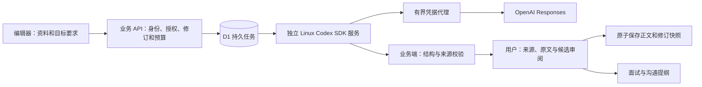

# Codex 材料任务：实现与运行

更新于 2026-09-13。新执行核心服务于真实经历整理、目标差异审阅和面试沟通准备。用户身份不受应届生或留学人群限制；`career` / `study` 继续作为模板与目标目录的兼容分类。

## 当前实现

业务端保存任务状态而不依赖浏览器连接。执行服务只拉取授权任务，不能直接连接数据库或提交简历；正式修改必须经过拥有者的确认 API。追问最多三轮执行、每轮最多三个问题，答案再次脱敏。每个任务最多八条候选及八条提纲，所有引用必须来自该任务材料或补充回答。

新流程处理规范文字，按最多 80 段 / 40000 字符及序列化 160 KB 拒绝超限材料，不静默丢弃材料。独立联系方式字段不投影，文字中的常见联系方式先隐藏。来源匹配不构成事实核验：新增数字、角色和日期须人工检查。用户勾选候选、确认事实后才可保存，任何简历或目标修订变化都会拒绝应用。

任务状态为 `queued → running → waiting_input → queued`，或者 `running → ready → applied`，另有失败、取消和到期。就绪任务仍需审阅，用户可结束审阅后创建新任务。正文、任务应用标识、选中候选 ID 与新修订快照在同一 D1 batch 中提交；同组重复应用只重放当前结果，不生成额外版本。

应用成功但网络回执丢失时，编辑器先用原候选选择重放一次应用；仍未确认时查询已应用任务及服务器正文进行恢复。恢复期间保持编辑锁，避免任务显示“已应用”而编辑器停留在旧版本。

## 配置与启用

1. 随应用发布迁移 `0013_codex_agent_jobs.sql` 和 `0014_codex_cost_provenance.sql`，数据库就绪版本为 14。请求期只检查，不执行 DDL。
2. 在 Worker 配置 `.env.example` 的 `CODEX_*` 字段：独立高强度 `CODEX_RUNNER_SECRET`、精确 `CODEX_MODEL`、每任务和全站日预算，显式设置 `CODEX_AGENT_ENABLED=true`。保留相互独立的认证、维护、活动摘要密钥。
3. 按 [执行服务 README](../services/codex-runner/README.md) 构建独立只读 Linux 容器。真实 `OPENAI_API_KEY` 只进入受信任协调进程，CLI 使用短期本地代理凭据与独立 UID、目录、进程组。禁止挂载用户家目录、其他工作区或 Docker socket。
4. 核对 runner 与 Worker 模型一致，runner 的输出 / 次数 / 预算上限可容纳 Worker 的任务配置，且该精确模型支持 SDK 使用的结构化输出和输入计数。价格没有默认值，按实际 API 项目与官方价格配置版本、输入/缓存/输出单价。
5. 完成真实环境验收：一个追问任务、一个候选任务、断线恢复、取消、故意变更资料后的应用拒绝、最终账单核对。通过前保持开关关闭。不能用桌面个人登录凭据替代服务端 API 配置。

服务仅在合法配置且匹配模型的 runner 最近 120 秒内领取或心跳成功时可用。页面明确区分未登录、未配置和执行服务离线。关闭开关停止新领取，心跳返回停止，后续完成回执只按失败结算。独立 runner 当前每实例顺序执行；D1 原子条件限制全站最多四项运行任务。不要在已有正常运行任务上手工重新排队。

## 接口

所有浏览器写请求校验同源，所有资源操作校验当前账号与简历归属；正式账号还须通过既有协议与会话验证。内部接口使用独立 Bearer 凭据，拒绝 Origin 请求，用户 API 不返回租约、应用令牌或执行配置。

| 路径 | 请求 / 返回重点 |
| --- | --- |
| `GET /api/agent-jobs?resumeId=…` | 最近 20 项未到期任务及公开可用状态 |
| `POST /api/agent-jobs` | `resumeId, expectedRevision, expectedBriefRevision, requestId, consent:true`；202 返回持久任务 |
| `GET /api/agent-jobs/{id}` | 当前状态、材料快照、结果、基础修订和到期时间 |
| `POST /api/agent-jobs/{id}/answers` | `expectedVersion, answers:[{questionId,text}]`；只接受当前全部问题 |
| `POST /api/agent-jobs/{id}/cancel` | `expectedVersion`；重复取消可重放 |
| `POST /api/agent-jobs/{id}/apply` | `expectedVersion, expectedRevision, expectedBriefRevision, proposalIds, confirmed:true` |
| `POST /api/internal/agent-jobs/claim` | `workerId, model`；原子领取，返回租约和剩余预算 |
| `POST /api/internal/agent-jobs/{id}/heartbeat` | `leaseToken, attempt, stage`；返回 `continue` |
| `POST /api/internal/agent-jobs/{id}/complete` | `leaseToken, attempt, result, usage` |
| `POST /api/internal/agent-jobs/{id}/fail` | `leaseToken, attempt, code, usage` |

`usage` 包含输入/缓存/输出 token、累计 `costMicros`、`modelCalls`，以及 runner 回传的 `priceVersion` 和 `costBasis`。价格来源未提供的历史或模拟回执标为 `unknown`；`reserved` 代表有付费调用的实际 usage 不确定，保留保守占额。

## 预算、故障与观测

试点不扣用户简迹点，旧 DeepSeek 计费流程继续独立。Codex 所有金额使用美元微元（1 USD = 1000000 micros），不可与旧人民币微元相加。创建任务在同一数据库语句与触发器内冻结整个任务上限，限制单用户滚动 24 小时创建次数和全站滚动 24 小时预留总额。取消、失败、删除任务均不退还平台保守占额；超限任务不会进入队列。

代理发出付费请求前，按非缓存输入上界与最大输出预留；未知 usage 保留在途预留。该上限适用于所配置纯文本 token 维度，输入计数、执行环境等适用费用须部署时核实。价格配置、API 账单与实际扣费需人工对账，不能把估算成本宣传为最终账单。

租约 90 秒，runner 约每 10 秒心跳，总执行上限 180 秒（可在 runner 配置更低）。取消与心跳失败会中止 CLI 进程组，迟到回执可以记录费用但不会恢复任务或改写正文。完成回执丢失只重发同一结果，不重复执行模型；仍不确定时退出，由租约维护标记中断。已运行而丢失 usage 的任务不自动重试。

管理员概览仅统计任务状态、交付/应用情况、预算预留、已知 token 估算、保守占额与失联情况，不读取材料正文。指标用于运行观察；取消率、任务复杂度和保留期限会影响比率，不等同于材料质量或面试效果。

外部调度器继续调用受保护的 `POST /api/maintenance/retention`。响应增加 `agentTasks` 清理计数和剩余到期数量；循环清理到期积压，至少每日运行。runner 领取前也做有界维护。对离线、持续租约中断、未知费用、执行失败及清理积压告警；开关关闭期间也需要维护任务。

## 数据生命周期与恢复

任务材料创建 7 天后停止通过任务 API 返回，后台分批删除。账号导出包含任务快照、来源、回答、候选、同意版本与用量记录，采用明确列白名单并计入原有导出大小限制。永久删除账号通过外键级联删除任务和执行记录，同时随机化平台预算记录的账号关联；预算记录保留 90 天，防止内容删除使平台预算重置。已应用正文按既有简历版本和删除机制管理。

原件上传/OCR、服务端 PDF 校验、作品集生成工具、授权协作、长久跨目标事实库及真实支付仍是后续阶段；当前不会静默启用这些能力。现有浏览器导入、Word/PDF/网页导出继续服务已确认正文。

## 验证

主应用运行 `npm run verify:release`。执行服务另运行 `node --test services/codex-runner/test/*.test.mjs`（先安装其独立锁定依赖）。SQLite 测试执行实际迁移与事务，涵盖 CAS、预算、租约、隐私导出/删除；runner 使用合成上游测试费用与故障边界。浏览器合成任务测试不等同于真实 API 验收。
