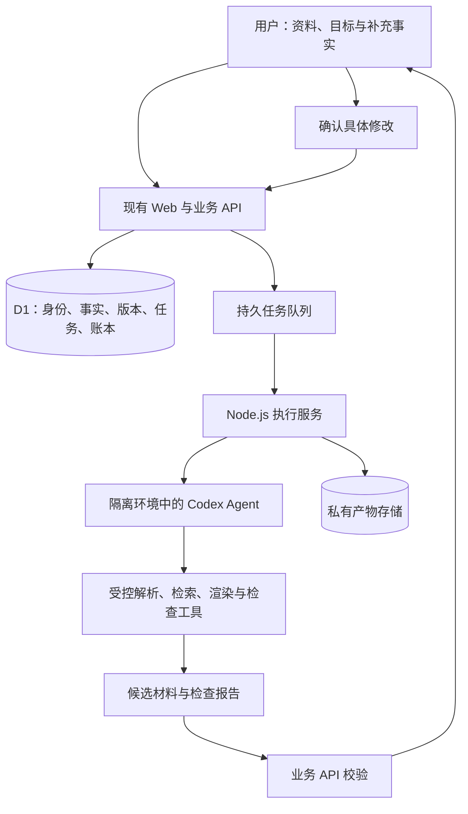

**简迹 CV：产品竞争策略与 Codex 核心架构方案**

研究日期：2026-09-12。源码基线：`bf61a54`。状态：已据此实现规范文字任务流程与异步执行基础，2026-09-13 完成本地整合；生产启用仍需 Linux 执行服务和真实 API 验收。阶段 C/D 是后续演进，当前能力与运行边界见 [Codex 任务运行手册](codex-agent-operations.md)。

**建议定位：把真实经历，整理成面向下一次机会的完整材料。**

产品向应届生、社招、转岗、科研申请和自由职业者开放。首轮验证围绕一种高频任务：用户已有经历和明确目标，需要从零散材料中选择证据、补齐叙述，并反复生成不同目标版本。注册、计费和底层数据不设置“必须是学生”之类的身份门槛。

获客实验先偏向正在密集投递、需要多次定制材料的人，社招与转岗用户值得优先招募，校招同样可参与。这是对使用频率与付费意愿的假设，不是已验证的市场结论。科研申请可以复用事实资产，但不在第一轮同时实现研究计划、推荐信等另一整套交付标准。

**竞争事实与取舍。** 以下来自厂商官网，未做付费产品实测，也不采用厂商的面试或录取提升百分比。

| 产品 | 已公开的主要能力 | 对我们的启示 |
| --- | --- | --- |
| [Teal](https://www.tealhq.com/) | 岗位收藏、申请进度、按岗位管理简历 | 单独增加投递看板很难构成优势 |
| [Rezi](https://www.rezi.ai/rezi-docs/ai-resume-agent) | 对话式简历 Agent、岗位定制、分析与面试准备 | 对话改简历已经进入直接竞争 |
| [Jobscan](https://www.jobscan.co/resume-scanner) | 简历与 JD 的匹配、关键词和格式诊断 | 另做一套不透明评分没有充分理由 |
| [Kickresume](https://www.kickresume.com/en/) | 模板、案例、AI 写作与岗位定制 | 模板数量与 AI 润色需要达到基本质量，但难独立支撑定位 |
| [超级简历](https://www.wondercv.com/) | 中英简历、JD 定制、校园场景与导师服务 | 双语和应届生市场都已有成熟参与者 |

Rezi 的 MCP 文档明确列出 Codex 客户端，以及简历列表、读取和写回能力。这证明竞品已有 Codex 接入流程，不能由此推断其后端就是 Codex，也不能把我们使用 Codex 宣传成独有能力。[Rezi MCP 文档](https://www.rezi.ai/rezi-docs/resume-mcp-server)

我们选择强化的是“用户愿意确认并实际使用的交付质量”。证据追溯、追问和跨文件一致性是否足以让用户选择我们，需要与通用聊天工具和现有简历产品对照验证；目前不能宣称行业首创。

**第一个值得完成的产品流程。**

用户导入旧简历、项目说明或粘贴经历，并提供一个目标岗位。系统先整理事实和冲突，再问最影响内容质量的几个问题。用户确认后，交付一份目标简历、一份对应的面试证据提纲和修改说明。第二个目标直接复用已确认经历。作品集页面放在这条流程验证之后扩展。

例如，原始材料只有“参与后台系统开发”。系统应追问个人完成的模块、实现方法、使用者以及有无可支持的效果记录。用户确认“独立实现权限配置模块，供 3 个业务组使用”，才允许把这些事实写入新稿。若没有效率数据，就描述职责、范围与方法；不能补造“提升效率 40%”。

| 应当形成的能力 | 用户可见结果 | 可以积累的产品资产 |
| --- | --- | --- |
| 可追溯的经历库 | 每条关键表述能回到材料片段或本人确认记录 | 用户可管理、可导出的事实与修订关系 |
| 有针对性的追问 | 一次只问影响目标匹配的缺口，允许回答“不知道” | 经授权、脱敏的错误分类与追问评测样本 |
| 多目标版本 | 同一经历可强调不同贡献，日期、角色和数字保持一致 | 事实到目标版本的依赖关系 |
| 完成交付与检查 | 文档可编辑、排版可读、文字可提取，面试提纲有依据 | 可重复运行的内容与产物质量检查 |
| 可审阅的修改 | 展示具体差异、依据与待确认事项，支持撤销 | 经用户授权的修改反馈，后续可支持导师协作 |

“有来源”不等于“事实已经客观验证”。数据中分别记录用户自述、材料支持、用户确认和适用的外部核验；不得把模型判断标记为事实认证。用户材料默认用于服务该用户，不能默认为公共语料或训练数据。

**现有实现最需要改变的地方。**

现有基础值得保留：账号隔离、简历修订、CAS 冲突检查、规范正文与多格式渲染、幂等账本、租约围栏和故障对账。它们是 Agent 输出可以被可靠接收的基础。

当前 `src/lib/rewrite-proposals.ts:188` 会过滤不符合直接应用规则的模型草稿；`:281` 的规则要求草稿等于本地 `tightenText` 的确定性输出。`src/lib/deepseek-advisor.ts:463` 起会对不合格定向改写报事实门错误，或回到本地候选。因此，仅替换模型不会自动获得更自由、有效的改写体验。

演进方式是增加明确的候选审阅阶段：允许 Codex 提出重组和改写，同时携带稳定事实 ID、来源定位、变更理由、未解决冲突。服务端校验结构、归属和引用；数字、时间、角色以及归因变更重点标记。模型语义检查只作为辅助。用户确认具体候选后，服务端按当前修订提交，原有直接应用的安全规则保留为独立快捷路径。

现有 `src/lib/advisor.ts:60` 起的分数由固定加分规则生成，上限为 96。产品中应把相关提示表述为可解释的完整性与证据检查，避免把它包装成企业 ATS 的录用概率。

现有请求还有 25 秒上游超时、请求中断传播、短租约、两分钟预留回收、15 分钟结果正文寿命和单请求成本记录。这些设计服务于一次短模型调用。异步 Agent 必须有独立任务生命周期，不能只延长 HTTP 超时或把 CLI 塞进原路由。

**Codex 核心架构。**

建议通过 TypeScript Codex SDK 在独立 Node.js 执行服务中运行 Codex。官方 SDK 支持服务端启动、继续和恢复本地任务；具体 SDK、CLI 和模型版本应在实现时固定并做契约测试。[Codex SDK](https://learn.chatgpt.com/docs/codex-sdk)

现有 Workers 继续负责产品 API。Workers 的 Node.js 兼容层包含部分占位实现，`node:child_process` 是 stub；据此不能在当前 Worker 中直接运行本机 Codex CLI，需要独立执行环境。[Cloudflare Node.js 兼容说明](https://developers.cloudflare.com/workers/runtime-apis/nodejs/)

Codex 决定任务步骤、组织材料、提出问题、编排工具和修订候选。鉴权、资源归属、正式版本提交、预算限制、扣费与删除仍由业务服务执行。Agent 工具只有当前任务所需的权限，不获得生产 SQL、支付凭据或其他用户数据。

官网将自动化任务指向 SDK，将深度客户端集成指向 app-server；当前文档同时标明 app-server 命令及 WebSocket 传输存在实验性和生产支持限制。第一阶段选择受控的 SDK/CLI 执行服务，通过自己的业务 API 向浏览器提供进度，不把 app-server 直接暴露为公共产品后端。[Codex app-server](https://learn.chatgpt.com/docs/app-server)

自动化使用单独管理的服务端凭据和预算。官方文档推荐 API key 作为自动化默认选择，也说明了 JSON 事件流、结构化输出和临时会话等能力。不能将当前桌面登录状态假定为可供多租户网站长期共用的生产凭据。[Codex 非交互运行](https://learn.chatgpt.com/docs/non-interactive-mode)

**第一阶段的具体技术边界。**

- 新增任务、执行步骤、候选稿和产物元数据；事实实体使用稳定 ID 与来源版本，目标使用可扩展的用途配置。原 `study/career` 数据兼容读取，先不强制重写历史简历。
- 新任务接口创建任务后立即返回 `202 + jobId`。前端通过产品自己的事件流或带游标的轮询获取状态。关闭网页不取消任务，取消使用显式接口。
- 生命周期包括排队、运行、等待补充、候选就绪、失败、取消和到期。等待用户补充时释放执行资源；恢复需重新校验用户、任务版本和预算。
- 任务创建与待投递事件一起持久化；队列按至少一次交付设计，消费者领取任务时检查 attempt 与租约围栏。数据库状态是权威记录，不能假定队列天然只执行一次。
- 一个任务可以有多次模型与工具调用。分别记录步骤用量、价格版本、预算预留、最终用户收费与实际服务成本。重试不得导致重复提交或重复扣费。
- 运行前显示预计范围与用户支出上限；每个受控执行切片前检查预算并预留在途调用成本。一个 SDK turn 可能包含多次模型与工具调用，不能把 turn 完成后的 usage 对账误当作运行中的硬预算。实现时必须验证固定版本可提供的调用边界、输出限制和中止语义，再决定切片大小与超额风险余量；无法满足的平台成本边界不得宣传为已实现。用户收费上限由账本保证，停止后仍需对账已发生的上游费用，平台可能承担中止生效前的费用。
- 每个用户任务使用隔离工作目录和执行环境。原件、JD、文档内指令均为不可信输入；凭据不进入模型可执行命令的环境。使用受控工具和凭据代理访问必要服务。
- 第一版只接收现有流程得到的规范正文与用户确认文字。当前 `.openai/hosting.json` 的 R2 为 `null`；原件上传、OCR、私有产物存储与扫描能力必须在真实配置后单独启用，保留现有本地导入入口。
- 第一阶段复用浏览器内的标准材料导出。当前 PDF 使用浏览器打印，DOCX/图片等也依赖现有客户端流程；仓库尚无可直接调用的完整服务端 PDF 渲染与产物检查工具。服务端渲染、文字提取、版面检查和产物报告需独立实现、验证，随后才交给 Codex 调用。定制网页代码生成放在后续阶段的独立沙箱，预览隔离来源，公开发布仍要求明确动作。
- 申请材料保存期限、任务日志、候选稿、临时目录和账号删除需要共同设计；清理会话记录不等于删除所有工具产物。旧建议接口的保留期继续适用旧数据。

拟议的首批工具包括读取当前目标、读取授权事实、提出补充问题和生成候选；事实一致性检查提供独立服务端校验。渲染材料和读取产物检查报告工具随服务端产物管线补齐后开放。第一版不向 Agent 提供任意数据库执行或自动投递能力。

**执行顺序与验收。** 阶段按结果推进，未假设现有生产执行服务或账号权限已经就绪。

| 阶段 | 交付 | 通过条件 |
| --- | --- | --- |
| A：验证真实价值 | 规范正文 + 一个 JD → Codex 追问/候选 → 差异确认 → 目标简历与面试提纲，先复用浏览器导出 | 合成样本能走通；引用可定位；过期修订拒绝应用；不依赖原件上传 |
| B：完善异步运行 | 持久队列、步骤记录、断线恢复、取消、预算、故障对账 | 重复投递、进程崩溃、超时恢复均无重复扣费或重复提交；取消能收敛 |
| C：扩大材料输入输出 | 经扫描的原件、私有存储、PDF/图片解析、服务端渲染与产物检查工具、作品集 | 删除与隔离验证通过；跨材料事实一致；导出与预览检查通过 |
| D：形成复用与协作 | 多目标版本、更新提醒、授权审阅与后续结果记录 | 第二份材料显著减少操作；协作不会扩大资料可见范围 |

A 的验证环境也必须具备最小隔离、硬预算和任务持久记录；B 是将这些机制补齐到可靠商用标准，不能把安全或计费正确性留到真实用户上线之后。

先保留旧路径作为显式回退，新的 Codex 流程通过功能开关逐步进入试点。回退时说明实际使用的能力和收费，不把本地规则结果显示为 Codex 交付。旧路径的下线以评测与运行证据为依据。

**验证优势，而不是用功能数量判断进度。**

招募约 30 位有真实目标的用户，覆盖应届、社招/转岗及少量相邻场景。使用相同材料，对照当前流程、通用聊天工具和选择的竞品。输出按匿名顺序交给用户及独立审阅者评价，记录材料复杂度和目标类型；这个规模用于发现问题，不足以证明面试率因果提升。

| 指标 | 定义与建议试点门槛 |
| --- | --- |
| 北极星 | 每周被用户确认可提交的目标材料包数 |
| 内容质量 | 严重的无依据事实新增为 0；关键表述都有可定位来源或明确本人确认 |
| 首次完成 | 输入资料到用户确认交付的中位耗时，相比对照减少至少 30% |
| 第二次使用 | 同一用户第二个目标的准备时间与修改量显著低于第一次 |
| 偏好 | 匿名对比中多数用户优先选择我们的交付，并记录选择理由 |
| 稳定性 | 跟踪任务成功率、取消收敛时间、无产物收费率、重复扣费率 |
| 经济性 | 每个成功材料包的模型、执行环境、存储、失败重试和支持成本；按复杂度观察 P50/P95 |

以上百分比与样本量是内部实验设定，不是产品已有成绩。面试邀请等后续结果应经授权记录，并控制岗位、背景、投递数量与渠道差异；不能直接将相关性宣传为产品效果。

**获客与收费。**

先用获得许可的案例展示“原材料 → 关键追问 → 可追溯修改 → 交付”的全过程，通过职场内容、技术/产品社群和少量职业顾问试点验证渠道。分别记录导入、事实确认、首次交付、第二目标和付费转化，以及每渠道的人工支持成本。校园渠道保留为一个实验，不成为产品的唯一入口。

付费假设优先测试明确的目标材料任务包和求职季用量包；保留免费基础编辑与导出。用户看到的是交付范围与花费上限，内部继续计量真实用量。现有 DeepSeek 的 1–5 点规则不能直接复制给多步骤 Codex；完成试点成本测量后再制定价格。当前支付尚未开放，不应提前展示可成功购买的假流程。

可积累的优势来自质量评测、经授权的纠错知识、可复用的个人经历资产、可靠交付与有效渠道。Codex 支撑执行能力；产品需要用真实任务证明这些能力值得用户迁移和付费。
